# 🏥 Helping Hand — Complete Architecture Documentation

> **Helping Hand** is a healthcare marketplace web application built with **Django**, **HTMX**, **PostgreSQL**, and **Tailwind CSS**. It connects patients with certified healthcare staff (nurses, caregivers) through agencies, enabling online booking, automated pricing, and review management.
>
> *Migrated from React/Firebase (NoSQL + localStorage) to strict relational Django ORM + PostgreSQL.*

---

## Table of Contents

1. [High-Level System Architecture](#1-high-level-system-architecture)
2. [Project Structure & Directory Layout](#2-project-structure--directory-layout)
3. [Technology Stack](#3-technology-stack)
4. [Data Model & Entity-Relationship Diagram](#4-data-model--entity-relationship-diagram)
5. [Django Request-Response Lifecycle](#5-django-request-response-lifecycle)
6. [URL Routing Architecture](#6-url-routing-architecture)
7. [Authentication & Authorization System](#7-authentication--authorization-system)
8. [Booking Lifecycle & State Machine](#8-booking-lifecycle--state-machine)
9. [Pricing Engine](#9-pricing-engine)
10. [Custom Managers & QuerySets](#10-custom-managers--querysets)
11. [Forms & Validation Pipeline](#11-forms--validation-pipeline)
12. [Template Inheritance & Frontend Architecture](#12-template-inheritance--frontend-architecture)
13. [Django Admin Configuration](#13-django-admin-configuration)
14. [Testing Architecture](#14-testing-architecture)
15. [Deployment & Configuration](#15-deployment--configuration)
16. [Complete End-to-End Data Flow](#16-complete-end-to-end-data-flow)
17. [Known Issues & Merge Conflicts](#17-known-issues--merge-conflicts)

---

## 1. High-Level System Architecture

The application follows a classic **Django MTV (Model-Template-View)** architecture with server-side rendering enhanced by **HTMX** for dynamic interactions without full page reloads.

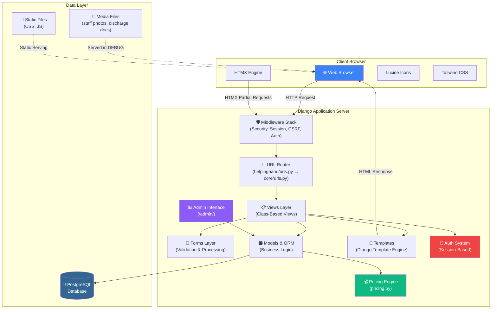

### How the layers interact

| Layer | Responsibility | Key Files |
|-------|---------------|-----------|
| **Client** | Renders HTML, sends HTTP/HTMX requests | `base.html`, Tailwind, HTMX, Lucide |
| **Middleware** | Security, sessions, CSRF, authentication | `settings.py` MIDDLEWARE list |
| **URL Router** | Maps URLs to view classes | `helpinghand/urls.py`, `core/urls.py` |
| **Views** | Handles business logic, returns responses | `core/views.py` (7 view classes) |
| **Forms** | Validates user input, creates/updates models | `core/forms.py` (5 form classes) |
| **Models/ORM** | Data persistence, business rules | `core/models.py` (4 models) |
| **Pricing** | Computes tiered pricing automatically | `core/pricing.py` |
| **Database** | Stores all application data | PostgreSQL via `psycopg2` |

> **Note:** The application was migrated from a React/Firebase frontend. Source references are documented in `core/models.py` lines 7–13.

---

## 2. Project Structure & Directory Layout

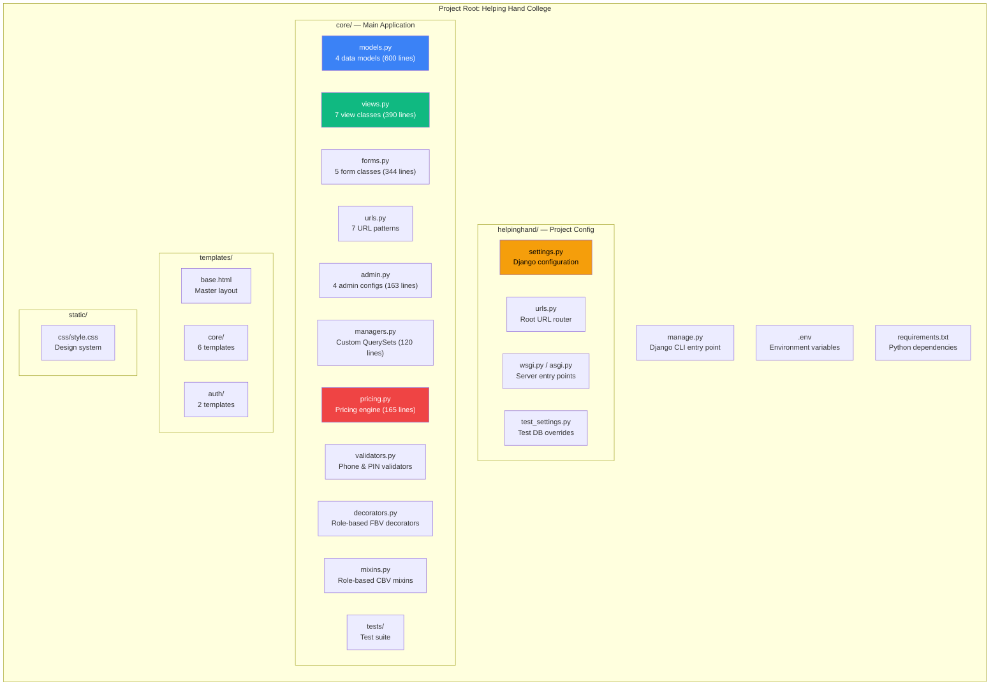

### File Inventory

| File | Purpose | Size |
|------|---------|------|
| `core/models.py` | User, StaffProfile, Booking, Review models | 600 lines (22,892 bytes) |
| `core/views.py` | Landing, Services, Support, Auth, Booking views | 390 lines (14,718 bytes) |
| `core/forms.py` | Registration, Login, Profile, Booking forms | 344 lines (11,379 bytes) |
| `core/admin.py` | Admin panel customization | 163 lines (6,630 bytes) |
| `core/pricing.py` | Service rates & discount calculations | 165 lines (4,692 bytes) |
| `core/managers.py` | Booking & StaffProfile custom querysets | 120 lines (3,828 bytes) |
| `core/decorators.py` | `@patient_required`, `@agency_required`, `@profile_complete_required` | 70 lines (1,989 bytes) |
| `core/mixins.py` | `PatientRequiredMixin`, `AgencyRequiredMixin`, `ProfileCompleteRequiredMixin` | 71 lines (2,241 bytes) |
| `core/validators.py` | `phone_validator` (10 digits), `pincode_validator` (6 digits) | 21 lines (436 bytes) |
| `core/urls.py` | 7 URL patterns | 23 lines (1,202 bytes) |
| `helpinghand/settings.py` | Django configuration (DB, Auth, etc.) | 123 lines (5,755 bytes) |
| `helpinghand/test_settings.py` | SQLite override for tests | 17 lines (463 bytes) |
| `templates/base.html` | Master layout with Tailwind + HTMX + Lucide | 3,807 bytes |
| `templates/core/landing.html` | Landing page | 15,526 bytes |
| `templates/core/services.html` | Services page | 5,792 bytes |
| `templates/core/support.html` | Support/FAQ page | 7,310 bytes |
| `templates/core/book.html` | Booking form page | 5,710 bytes |
| `templates/core/_navbar.html` | Navbar partial | 5,854 bytes |
| `templates/core/_footer.html` | Footer partial | 5,928 bytes |
| `templates/auth/login.html` | Login page | 3,480 bytes |
| `templates/auth/register.html` | Registration page | 6,300 bytes |

---

## 3. Technology Stack

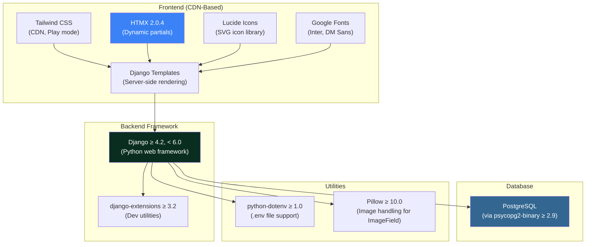

### Dependencies (`requirements.txt`)

```python
# Core framework
Django>=4.2,<6.0

# PostgreSQL adapter
psycopg2-binary>=2.9

# Environment variables (.env support)
python-dotenv>=1.0

# Django developer utilities (shell_plus, runserver_plus, etc.)
django-extensions>=3.2

# Image handling (required by ImageField in StaffProfile)
Pillow>=10.0
```

---

## 4. Data Model & Entity-Relationship Diagram

The application uses **4 core models** with a strict relational schema enforcing healthcare business rules at the database level.

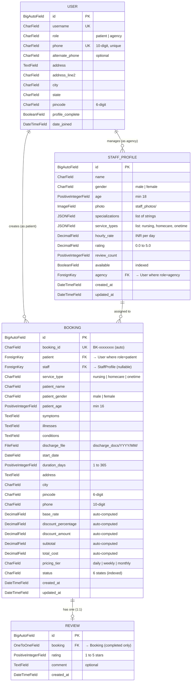

### Model Relationships Summary

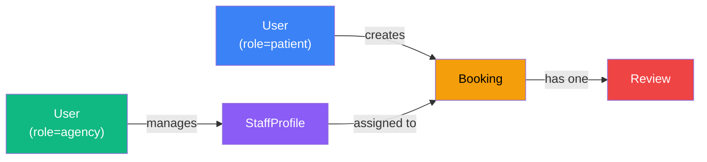

### User Model (`core/models.py:53–133`)

Extends Django's `AbstractUser` with two roles and healthcare-specific fields:

```python
class User(AbstractUser):
    class Role(models.TextChoices):
        PATIENT = 'patient', 'Patient'
        AGENCY  = 'agency',  'Agency Manager'

    role = models.CharField(
        max_length=10,
        choices=Role.choices,
        default=Role.PATIENT,
        db_index=True,  # Optimized for role-based queries
    )
    phone = models.CharField(max_length=15, unique=True, validators=[phone_validator])
    profile_complete = models.BooleanField(default=False)

    @property
    def is_patient(self):
        return self.role == self.Role.PATIENT

    @property
    def is_agency(self):
        return self.role == self.Role.AGENCY
```

> **Important:** `AUTH_USER_MODEL = 'core.User'` in `settings.py:91` replaces Django's default User model.

### StaffProfile Model (`core/models.py:139–249`)

Healthcare staff managed by agencies, with JSONField for flexible service types:

```python
class StaffProfile(models.Model):
    class Gender(models.TextChoices):
        MALE = 'male', 'Male'
        FEMALE = 'female', 'Female'

    class ServiceType(models.TextChoices):
        NURSING = 'nursing', 'Nursing Care'
        HOMECARE = 'homecare', 'Home Care'
        ONETIME = 'onetime', 'One-Time Service'

    name = models.CharField(max_length=200)
    gender = models.CharField(max_length=10, choices=Gender.choices)
    age = models.PositiveIntegerField(validators=[MinValueValidator(18)])
    specializations = models.JSONField(default=list)   # ["Nursing Care", "Post-Surgery"]
    service_types = models.JSONField(default=list)     # ["nursing", "onetime"]
    hourly_rate = models.DecimalField(max_digits=8, decimal_places=2)
    rating = models.DecimalField(max_digits=3, decimal_places=1, default=Decimal('0.0'))
    available = models.BooleanField(default=True, db_index=True)
    agency = models.ForeignKey(
        settings.AUTH_USER_MODEL,
        on_delete=models.CASCADE,
        related_name='staff_profiles',
        limit_choices_to={'role': User.Role.AGENCY},
    )
```

### Booking Model — Business Rules (`core/models.py:255–554`)

The central transaction model enforcing healthcare rules:

```python
class Booking(models.Model):
    class Status(models.TextChoices):
        PENDING     = 'pending',     'Pending'
        REVIEWING   = 'reviewing',   'Under Review'
        CONFIRMED   = 'confirmed',   'Confirmed'
        IN_PROGRESS = 'in-progress', 'In Progress'
        COMPLETED   = 'completed',   'Completed'
        CANCELLED   = 'cancelled',   'Cancelled'

    # Auto-generated unique ID
    booking_id = models.CharField(max_length=20, unique=True, editable=False)

    # Relationships with role constraints
    patient = models.ForeignKey(User, limit_choices_to={'role': 'patient'}, ...)
    staff = models.ForeignKey(StaffProfile, null=True, blank=True, ...)

    # Pricing fields (auto-computed on every save())
    base_rate = models.DecimalField(...)
    discount_percentage = models.DecimalField(...)
    total_cost = models.DecimalField(...)

    def clean(self):
        """Enforce: gender matching + service type compatibility"""
        if self.staff and self.staff.gender != self.patient_gender:
            raise ValidationError('Staff gender must match patient gender.')
        if self.staff and self.service_type not in self.staff.service_types:
            raise ValidationError('Staff does not provide this service.')

    def save(self, *args, **kwargs):
        if not self.booking_id:
            self.booking_id = f'BK-{uuid.uuid4().hex[:8]}'
        self._compute_pricing()     # Always recompute
        if not self.pk:
            self._determine_initial_status()
        super().save(*args, **kwargs)
```

### Review Model (`core/models.py:561–600`)

One review per booking (1:1), only for completed bookings:

```python
class Review(models.Model):
    booking = models.OneToOneField(
        Booking,
        on_delete=models.CASCADE,
        limit_choices_to={'status': 'completed'},
    )
    rating = models.PositiveIntegerField(
        validators=[MinValueValidator(1), MaxValueValidator(5)]
    )
    comment = models.TextField(blank=True, default='')

    def clean(self):
        if self.booking.status != Booking.Status.COMPLETED:
            raise ValidationError('Reviews only for completed bookings.')
```

---

## 5. Django Request-Response Lifecycle

This diagram traces a complete HTTP request through every layer:

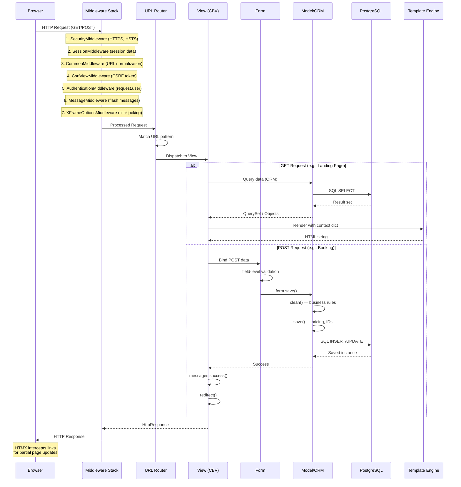

### Middleware Stack (`settings.py:43–51`)

```python
MIDDLEWARE = [
    'django.middleware.security.SecurityMiddleware',            # HTTPS, HSTS headers
    'django.contrib.sessions.middleware.SessionMiddleware',     # Session cookies
    'django.middleware.common.CommonMiddleware',                # URL normalization
    'django.middleware.csrf.CsrfViewMiddleware',               # CSRF protection
    'django.contrib.auth.middleware.AuthenticationMiddleware',  # Sets request.user
    'django.contrib.messages.middleware.MessageMiddleware',     # Flash messages
    'django.middleware.clickjacking.XFrameOptionsMiddleware',  # X-Frame-Options
]
```

---

## 6. URL Routing Architecture

The application uses a **two-level URL routing** strategy:

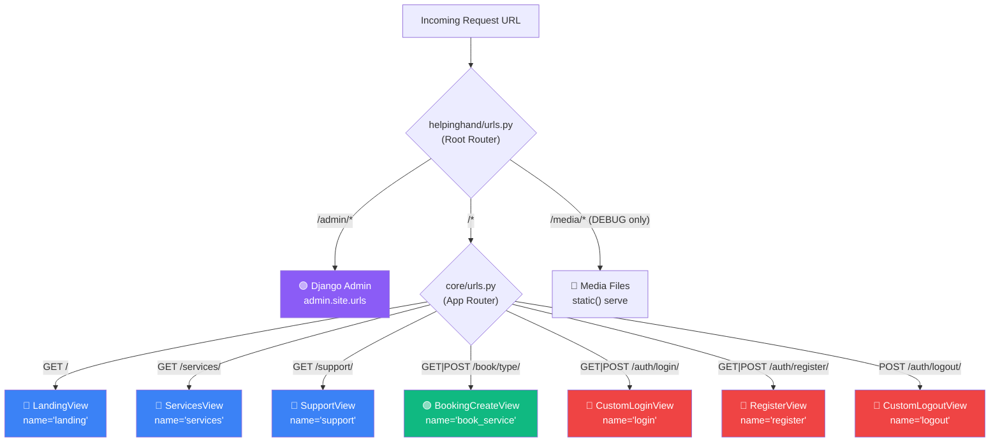

### Root URL Configuration (`helpinghand/urls.py`)

```python
from django.contrib import admin
from django.urls import path, include
from django.conf import settings
from django.conf.urls.static import static

urlpatterns = [
    path('admin/', admin.site.urls),      # Django admin panel
    path('', include('core.urls')),       # All app routes delegated to core
]

# Serve media files in development only
if settings.DEBUG:
    urlpatterns += static(settings.MEDIA_URL, document_root=settings.MEDIA_ROOT)
```

### App URL Configuration (`core/urls.py`)

```python
from django.urls import path
from . import views

urlpatterns = [
    # Public Pages
    path('',          views.LandingView.as_view(),       name='landing'),
    path('services/', views.ServicesView.as_view(),       name='services'),
    path('support/',  views.SupportView.as_view(),        name='support'),

    # Services / Booking
    path('book/<str:service_type>/', views.BookingCreateView.as_view(), name='book_service'),

    # Authentication
    path('auth/login/',    views.CustomLoginView.as_view(),  name='login'),
    path('auth/register/', views.RegisterView.as_view(),     name='register'),
    path('auth/logout/',   views.CustomLogoutView.as_view(), name='logout'),
]
```

### URL → View → Template Mapping

| URL Pattern | View Class | Template | Auth | Description |
|-------------|-----------|----------|------|-------------|
| `/` | `LandingView` | `core/landing.html` | Public | Hero, services, how-it-works, pricing, testimonials |
| `/services/` | `ServicesView` | `core/services.html` | Public | Detailed service cards with features |
| `/support/` | `SupportView` | `core/support.html` | Public | Searchable FAQ accordion + contact |
| `/book/<service_type>/` | `BookingCreateView` | `core/book.html` | Login | Service booking form |
| `/auth/login/` | `CustomLoginView` | `auth/login.html` | Public | Username + password login |
| `/auth/register/` | `RegisterView` | `auth/register.html` | Public | Role-based registration |
| `/auth/logout/` | `CustomLogoutView` | — | Auth | Logout + redirect to landing |
| `/admin/` | Django Admin | Built-in | Staff | Full admin panel |

---

## 7. Authentication & Authorization System

### Registration Flow

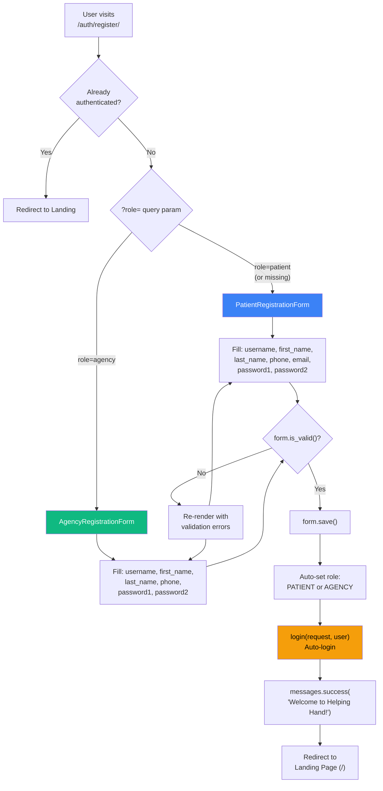

### Registration Code (`core/views.py:269–311`)

```python
class RegisterView(FormView):
    template_name = 'auth/register.html'
    success_url = reverse_lazy('landing')

    def get_role(self):
        """Determine role from ?role= query parameter."""
        role = self.request.GET.get('role', 'patient')
        return role if role in ('patient', 'agency') else 'patient'

    def get_form_class(self):
        """Return the correct form based on selected role."""
        if self.get_role() == 'agency':
            return AgencyRegistrationForm
        return PatientRegistrationForm

    def form_valid(self, form):
        user = form.save()           # Creates user with auto-set role
        login(self.request, user)    # Auto-login after registration
        messages.success(self.request, f'Welcome to Helping Hand, {user.get_full_name()}!')
        return redirect(self.success_url)

    def dispatch(self, request, *args, **kwargs):
        if request.user.is_authenticated:
            return redirect('landing')
        return super().dispatch(request, *args, **kwargs)
```

### Login/Logout Flow

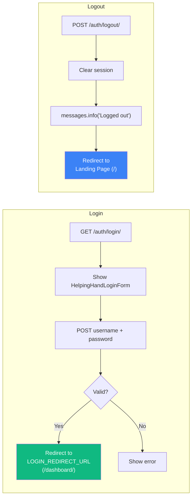

### Auth Settings (`settings.py:101–104`)

```python
LOGIN_URL            = '/auth/login/'      # Where @login_required redirects
LOGIN_REDIRECT_URL   = '/dashboard/'       # After successful login
LOGOUT_REDIRECT_URL  = '/'                 # After logout
```

### Authorization — Dual Pattern (Decorators + Mixins)

The application provides **two parallel authorization systems** for maximum flexibility:

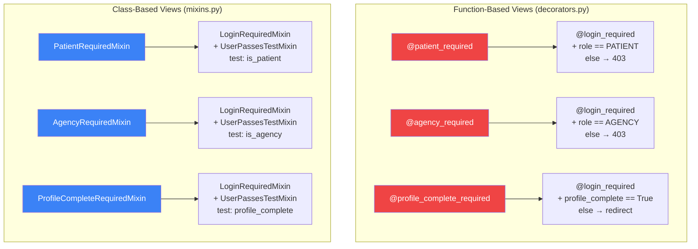

**Decorator usage example:**

```python
# For function-based views
@patient_required
def my_booking_view(request):
    # Only authenticated patients reach here
    bookings = Booking.objects.filter(patient=request.user)
    ...
```

**Mixin usage example:**

```python
# For class-based views
class DashboardView(PatientRequiredMixin, TemplateView):
    template_name = 'core/dashboard.html'
    # Only authenticated patients reach here
```

**Decorator implementation (`core/decorators.py`):**

```python
def patient_required(view_func):
    @wraps(view_func)
    @login_required
    def _wrapped(request, *args, **kwargs):
        if not request.user.is_patient:
            raise PermissionDenied('This page is only accessible to patient accounts.')
        return view_func(request, *args, **kwargs)
    return _wrapped
```

**Mixin implementation (`core/mixins.py`):**

```python
class AgencyRequiredMixin(LoginRequiredMixin, UserPassesTestMixin):
    def test_func(self):
        return self.request.user.is_agency

    def handle_no_permission(self):
        if self.request.user.is_authenticated:
            raise PermissionDenied('Agency manager accounts only.')
        return super().handle_no_permission()  # Redirect to login
```

---

## 8. Booking Lifecycle & State Machine

The Booking model implements a **6-state lifecycle** with automated transitions:

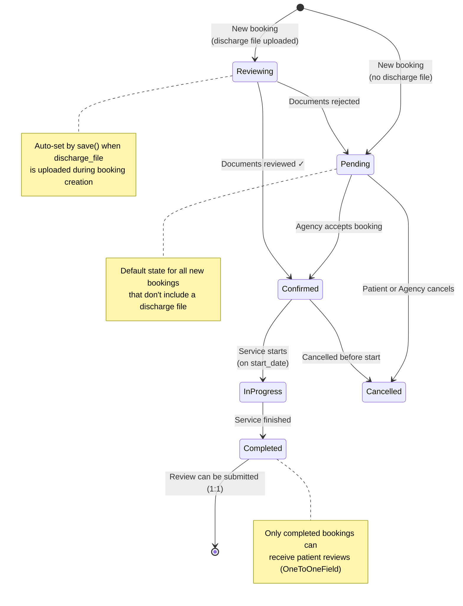

### Status Values (`core/models.py:269–275`)

| Status | DB Value | Display | Category |
|--------|----------|---------|----------|
| Pending | `pending` | Pending | **Active** |
| Under Review | `reviewing` | Under Review | **Active** |
| Confirmed | `confirmed` | Confirmed | **Active** |
| In Progress | `in-progress` | In Progress | **Active** |
| Completed | `completed` | Completed | **Past** |
| Cancelled | `cancelled` | Cancelled | **Past** |

### Automatic Status Determination (`core/models.py:472–479`)

```python
def _determine_initial_status(self):
    """Set initial status based on whether a discharge file is uploaded."""
    if not self.pk or self.status == self.Status.PENDING:
        if self.discharge_file:
            self.status = self.Status.REVIEWING   # Auto-escalate
        elif self.status not in [s[0] for s in self.Status.choices]:
            self.status = self.Status.PENDING
```

### Booking ID Generation (`core/models.py:448–451`)

```python
def _generate_booking_id(self):
    """Generate a unique booking ID with BK- prefix."""
    short_uuid = uuid.uuid4().hex[:8]
    return f'BK-{short_uuid}'
    # Example output: BK-a1b2c3d4
```

### Active vs. Past Bookings

```python
@property
def is_active(self):
    return self.status in [
        self.Status.PENDING,
        self.Status.CONFIRMED,
        self.Status.IN_PROGRESS,
        self.Status.REVIEWING,
    ]
# Completed and Cancelled = "past" bookings

@property
def end_date(self):
    """Computed: start_date + duration_days - 1"""
    if self.start_date:
        return self.start_date + timedelta(days=self.duration_days - 1)
    return None
```

### Booking Creation View (`core/views.py:351–389`)

```python
class BookingCreateView(LoginRequiredMixin, CreateView):
    """View for users to create a booking for a specific service."""
    model = Booking
    form_class = BookingForm
    template_name = 'core/book.html'
    success_url = reverse_lazy('landing')

    def get_initial(self):
        initial = super().get_initial()
        user = self.request.user
        initial['patient_name'] = user.get_full_name()
        initial['phone'] = user.phone
        initial['address'] = user.address
        initial['city'] = user.city
        initial['pincode'] = user.pincode
        return initial

    def form_valid(self, form):
        form.instance.patient = self.request.user
        form.instance.service_type = self.kwargs.get('service_type')
        messages.success(self.request, 'Your booking has been successfully placed!')
        return super().form_valid(form)
```

---

## 9. Pricing Engine

The pricing engine (`core/pricing.py`) implements a **tiered discount system** based on service type and booking duration.

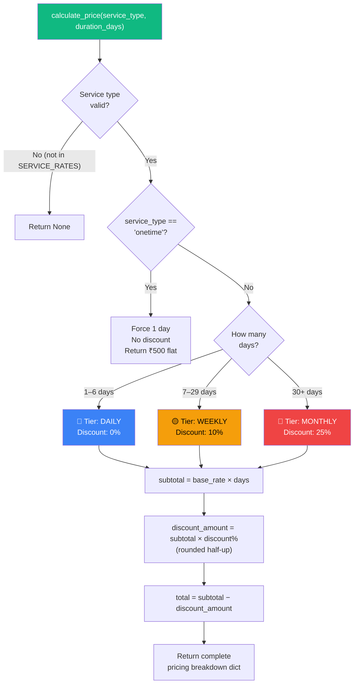

### Service Rates (INR per day)

| Service Type | Daily Rate | Weekly Rate (10% off) | Monthly Rate (25% off) |
|:------------|:-----------|:---------------------|:----------------------|
| 🩺 Nursing Care | ₹1,500/day | ₹1,350/day | ₹1,125/day |
| 🏠 Home Care | ₹1,000/day | ₹900/day | ₹750/day |
| 🤝 One-Time Service | ₹500 (flat) | N/A | N/A |

### Discount Tiers

| Tier | Duration | Discount | Example (Nursing, 14 days) |
|------|----------|----------|---------------------------|
| Daily | 1–6 days | 0% | 5 × ₹1,500 = ₹7,500 |
| Weekly | 7–29 days | 10% | 14 × ₹1,500 = ₹21,000 − ₹2,100 = **₹18,900** |
| Monthly | 30+ days | 25% | 30 × ₹1,500 = ₹45,000 − ₹11,250 = **₹33,750** |

### Core Pricing Code (`core/pricing.py`)

```python
SERVICE_RATES = {
    'nursing':  {'daily': Decimal('1500'), 'label': 'Nursing Care'},
    'homecare': {'daily': Decimal('1000'), 'label': 'Home Care'},
    'onetime':  {'daily': Decimal('500'),  'label': 'One-Time Service'},
}

DISCOUNT_TIERS = {
    'daily':   {'min_days': 1,  'max_days': 6,    'discount': Decimal('0')},
    'weekly':  {'min_days': 7,  'max_days': 29,   'discount': Decimal('0.10')},
    'monthly': {'min_days': 30, 'max_days': None,  'discount': Decimal('0.25')},
}

def calculate_price(service_type, duration_days):
    rate = SERVICE_RATES.get(service_type)
    if rate is None:
        return None

    if service_type == 'onetime':
        return {'base_rate': rate['daily'], 'total': rate['daily'],
                'tier': 'daily', 'discount': Decimal('0'), ...}

    tier = get_tier(duration_days)
    subtotal = rate['daily'] * duration_days
    discount_amount = (subtotal * tier['discount']).quantize(
        Decimal('1'), rounding=ROUND_HALF_UP
    )
    total = subtotal - discount_amount
    return {'base_rate': rate['daily'], 'subtotal': subtotal,
            'discount': tier['discount'], 'discount_amount': discount_amount,
            'total': total, 'tier': tier['label'], ...}

def format_currency(amount) -> str:
    """Format as Indian Rupees: format_currency(1500) → '₹1,500'"""
    return f'₹{int(amount):,}'
```

### Pricing is Auto-Computed in Booking.save()

```python
def save(self, *args, **kwargs):
    if not self.booking_id:
        self.booking_id = self._generate_booking_id()
    self._compute_pricing()    # ← Always recompute on every save!
    if not self.pk:
        self._determine_initial_status()
    super().save(*args, **kwargs)
```

---

## 10. Custom Managers & QuerySets

The application implements the **Manager-QuerySet pattern** for chainable, reusable queries:

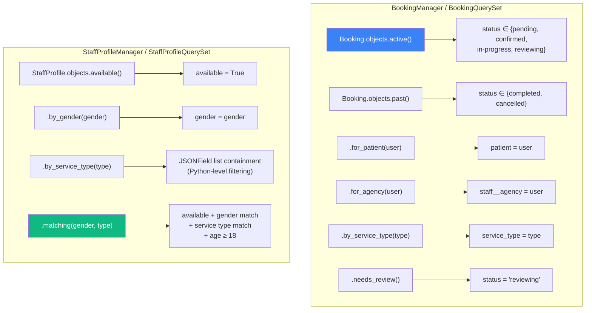

### Chainable Query Examples

```python
# Get all active nursing bookings for a patient
Booking.objects.active().for_patient(request.user).by_service_type('nursing')

# Get bookings awaiting discharge document review
Booking.objects.needs_review()

# Find available female staff who provide nursing care
StaffProfile.objects.matching('female', 'nursing')
```

### Staff Matching Logic (`core/managers.py:86–101`)

Mirrors the original React `findMatchingStaff()` function:

```python
def matching(self, patient_gender, service_type):
    """Find available staff matching both gender and service type."""
    base_qs = (
        self.available()
        .by_gender(patient_gender)
        .filter(age__gte=18)
    )
    # JSONField list containment (DB-agnostic approach)
    pks = [
        obj.pk for obj in base_qs
        if service_type in (obj.service_types or [])
    ]
    return base_qs.filter(pk__in=pks)
```

> **Note:** JSONField `__contains` isn't supported on SQLite, so the code uses a Python-level filter that works on all database backends. On PostgreSQL in production, this can be optimized with native `__contains` lookups.

---

## 11. Forms & Validation Pipeline

The application uses a **4-layer validation** strategy:

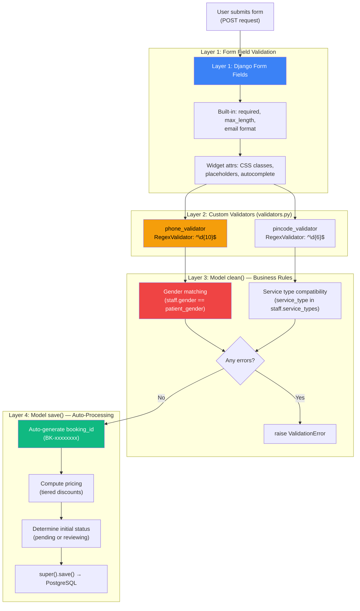

### Form Classes (`core/forms.py`)

| Form Class | Parent | Purpose | Auto-sets |
|-----------|--------|---------|-----------
| `PatientRegistrationForm` | `UserCreationForm` | Patient sign-up (username, name, phone, email, password) | `role = PATIENT` |
| `AgencyRegistrationForm` | `UserCreationForm` | Agency manager sign-up (username, name, phone, password) | `role = AGENCY` |
| `HelpingHandLoginForm` | `AuthenticationForm` | Styled login (username + password) | — |
| `ProfileCompletionForm` | `ModelForm` | Address & profile completion | `profile_complete = True` |
| `BookingForm` | `ModelForm` | Healthcare service booking form | — |

### Form save() — Role Assignment

```python
# PatientRegistrationForm.save()
def save(self, commit=True):
    user = super().save(commit=False)
    user.role = User.Role.PATIENT  # Always set to Patient
    if commit:
        user.save()
    return user

# AgencyRegistrationForm.save()
def save(self, commit=True):
    user = super().save(commit=False)
    user.role = User.Role.AGENCY   # Always set to Agency
    if commit:
        user.save()
    return user
```

### BookingForm (`core/forms.py:309–344`)

```python
class BookingForm(forms.ModelForm):
    """Form for creating a new healthcare service booking."""
    
    start_date = forms.DateField(
        widget=forms.DateInput(attrs={'class': 'input-field', 'type': 'date'})
    )

    class Meta:
        model = Booking
        fields = [
            'patient_name', 'patient_gender', 'patient_age',
            'symptoms', 'illnesses', 'conditions',
            'start_date', 'duration_days',
            'address', 'city', 'pincode', 'phone',
            'discharge_file'
        ]
```

### Custom Validators (`core/validators.py`)

```python
phone_validator = RegexValidator(
    regex=r'^\d{10}$',
    message='Phone number must be exactly 10 digits.',
)

pincode_validator = RegexValidator(
    regex=r'^\d{6}$',
    message='Pin code must be exactly 6 digits.',
)
```

---

## 12. Template Inheritance & Frontend Architecture

```mermaid
graph TD
    subgraph "Template Hierarchy"
        A["base.html<br/>Master Layout<br/>(3,807 bytes)"]
        A --> B["core/landing.html<br/>(15,526 bytes)"]
        A --> C["core/services.html<br/>(5,792 bytes)"]
        A --> D["core/support.html<br/>(7,310 bytes)"]
        A --> D2["core/book.html<br/>(5,710 bytes)"]
        A --> E["auth/login.html<br/>(3,480 bytes)"]
        A --> F["auth/register.html<br/>(6,300 bytes)"]
    end

    subgraph "Partials"
        G["core/_navbar.html<br/>(5,854 bytes)"]
        H["core/_footer.html<br/>(5,928 bytes)"]
    end

    A -->|"include"| G
    A -->|"include"| H

    subgraph "Frontend Libraries (CDN)"
        I["Tailwind CSS (CDN)"]
        J["HTMX 2.0.4"]
        K["Lucide Icons"]
        L["Custom CSS<br/>(static/css/style.css)"]
    end

    A -->|"script"| I
    A -->|"script"| J
    A -->|"script"| K
    A -->|"link"| L

    style A fill:#f59e0b,color:#000
    style B fill:#3b82f6,color:#fff
    style C fill:#3b82f6,color:#fff
    style D fill:#3b82f6,color:#fff
    style D2 fill:#10b981,color:#fff
    style E fill:#ef4444,color:#fff
    style F fill:#ef4444,color:#fff
```

### Base Template Blocks (`templates/base.html`)

```html

<!DOCTYPE html>
<html lang="en">
<head>
  <meta name="description" content="...">
  <title>Helping Hand — Home Healthcare</title>

  <script src="https://cdn.tailwindcss.com"></script>     <!-- Tailwind -->
  <link rel="stylesheet" href="">  <!-- Custom CSS -->
  <script src="https://unpkg.com/htmx.org@2.0.4"></script>    <!-- HTMX -->
  <script src="https://unpkg.com/lucide@latest"></script>      <!-- Icons -->

  
</head>
<body>
       <!-- Reusable navbar -->

  
    <!-- Flash messages — auto-dismiss after 5s -->
    
      <div class="card animate-fade-in-up border-l-4 ...">{{ message }}</div>
    
  

  <main></main>

       <!-- Reusable footer -->

  <script>
    // Initialize + re-init icons after HTMX partial swaps
    document.addEventListener('DOMContentLoaded', () => lucide.createIcons());
    document.body.addEventListener('htmx:afterSwap', () => lucide.createIcons());
  </script>

  
</body>
</html>
```

### HTMX Integration Pattern

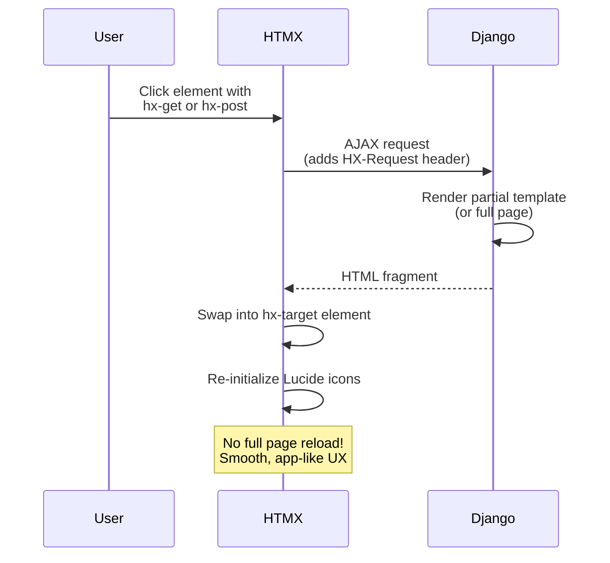

### Tailwind Configuration (in base.html)

```javascript
tailwind.config = {
  theme: {
    extend: {
      fontFamily: {
        heading: ['Inter', 'system-ui', 'sans-serif'],
        body: ['DM Sans', 'system-ui', 'sans-serif'],
      },
    },
  },
}
```

---

## 13. Django Admin Configuration

The admin interface (`core/admin.py`) provides a comprehensive back-office management system:

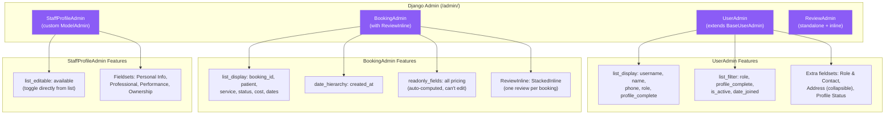

### Key Admin Code (`core/admin.py`)

```python
@admin.register(Booking)
class BookingAdmin(admin.ModelAdmin):
    list_display = [
        'booking_id', 'patient_name', 'service_type', 'status',
        'start_date', 'duration_days', 'total_cost', 'staff', 'created_at',
    ]

    # All pricing fields are read-only (auto-computed by model save())
    readonly_fields = [
        'booking_id', 'base_rate', 'discount_percentage',
        'discount_amount', 'subtotal', 'total_cost', 'pricing_tier',
        'created_at', 'updated_at',
    ]

    # Show review inline within booking detail
    inlines = [ReviewInline]

    # Navigate bookings by date
    date_hierarchy = 'created_at'
```

```python
@admin.register(StaffProfile)
class StaffProfileAdmin(admin.ModelAdmin):
    list_display = ['name', 'gender', 'age', 'get_service_types',
                    'hourly_rate', 'rating', 'available', 'agency']
    list_editable = ['available']  # Toggle availability from list view!
```

---

## 14. Testing Architecture

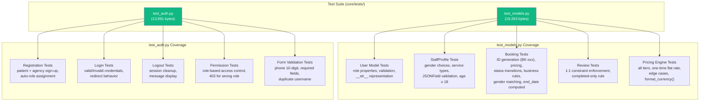

### Test Configuration (`helpinghand/test_settings.py`)

Overrides database to use SQLite for faster in-memory testing:

```python
# Run all tests
python manage.py test core.tests --settings=helpinghand.test_settings

# Run specific modules
python manage.py test core.tests.test_models --settings=helpinghand.test_settings
python manage.py test core.tests.test_auth --settings=helpinghand.test_settings
```

---

## 15. Deployment & Configuration

### Environment Variables Flow

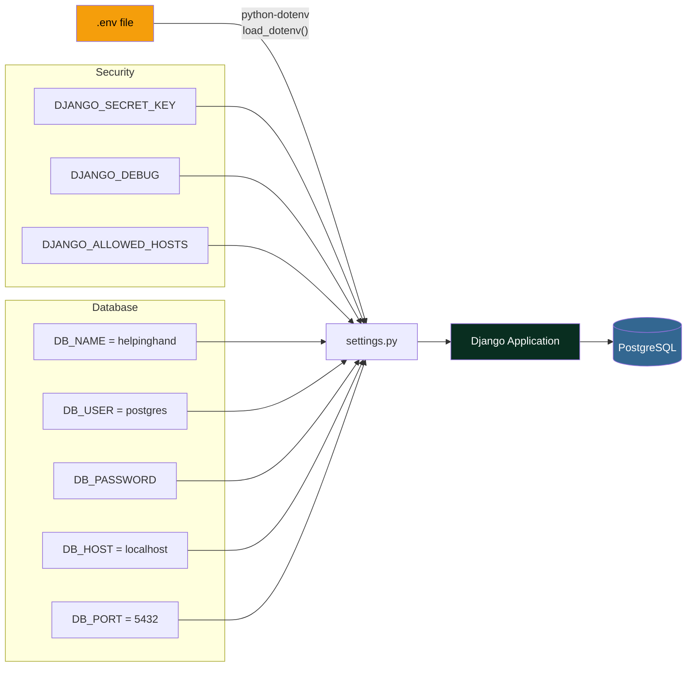

### Key Settings (`helpinghand/settings.py`)

```python
# Security — loaded from .env with safe dev defaults
SECRET_KEY = os.getenv('DJANGO_SECRET_KEY', 'django-insecure-dev-key-...')
DEBUG = os.getenv('DJANGO_DEBUG', 'True').lower() in ('true', '1', 'yes')
ALLOWED_HOSTS = os.getenv('DJANGO_ALLOWED_HOSTS', 'localhost,127.0.0.1').split(',')

# Database — PostgreSQL
DATABASES = {
    'default': {
        'ENGINE': 'django.db.backends.postgresql',
        'NAME': os.getenv('DB_NAME', 'helpinghand'),
        'USER': os.getenv('DB_USER', 'postgres'),
        'PASSWORD': os.getenv('DB_PASSWORD', 'postgres'),
        'HOST': os.getenv('DB_HOST', 'localhost'),
        'PORT': os.getenv('DB_PORT', '5432'),
        'OPTIONS': {'connect_timeout': 5, 'sslmode': 'require'},
    }
}

# Custom User Model
AUTH_USER_MODEL = 'core.User'

# Timezone (India Standard Time)
TIME_ZONE = 'Asia/Kolkata'

# Static & Media files
STATIC_URL = 'static/'
STATICFILES_DIRS = [BASE_DIR / 'static']
STATIC_ROOT = BASE_DIR / 'staticfiles'
MEDIA_URL = 'media/'
MEDIA_ROOT = BASE_DIR / 'media'
```

---

## 16. Complete End-to-End Data Flow

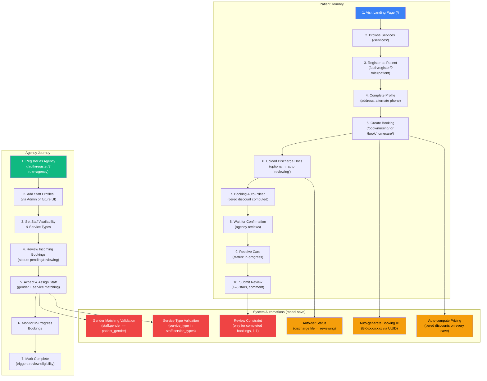

---

## 17. Known Issues & Merge Conflicts

> ⚠️ **The codebase currently contains unresolved git merge conflicts** from a merge between the `HEAD` branch and commit `c33abf1` ("Reworked the whole architecture with Django & PostgreSQL"). These must be resolved before the application can run.

### Affected Files

| File | Conflict Summary |
|------|-----------------|
| `core/models.py` | Module-level enums vs. class-level enums; `BookingManager`/`StaffProfileManager` as `as_manager()` vs. explicit class; pricing recompute strategy (dirty-check vs. always-recompute) |
| `core/forms.py` | `BaseRegistrationForm` pattern vs. duplicated forms; `PatientRegistrationForm` inheritance |
| `core/managers.py` | `as_manager()` shortcut vs. explicit Manager classes with `get_queryset()` delegation |
| `core/pricing.py` | `get_tiered_prices()` utility function (only in HEAD branch) |

### Resolution Strategy

The conflicts represent two valid approaches:
- **HEAD branch**: Refactored with DRY patterns (`BaseRegistrationForm`, `as_manager()`, `get_tiered_prices()`)
- **c33abf1 branch**: Original working implementation with explicit, verbose code

Choose one branch's approach consistently and remove all `<<<<<<<`, `=======`, `>>>>>>>` markers.

---

## Quick Start

```bash
# 1. Install dependencies
pip install -r requirements.txt

# 2. Create PostgreSQL database
createdb helpinghand

# 3. Configure environment
cp .env.example .env   # Edit DB credentials

# 4. Run migrations
python manage.py migrate

# 5. Create superuser for admin access
python manage.py createsuperuser

# 6. Start development server
python manage.py runserver

# 7. Access the application
# Landing page:  http://localhost:8000/
# Admin panel:   http://localhost:8000/admin/
# Register:      http://localhost:8000/auth/register/?role=patient
# Login:         http://localhost:8000/auth/login/
# Services:      http://localhost:8000/services/
# Support/FAQ:   http://localhost:8000/support/
# Book Nursing:  http://localhost:8000/book/nursing/
```

---

*Architecture documentation for the Helping Hand College codebase — a Django healthcare marketplace migrated from React/Firebase.*
*Updated: May 2026*
